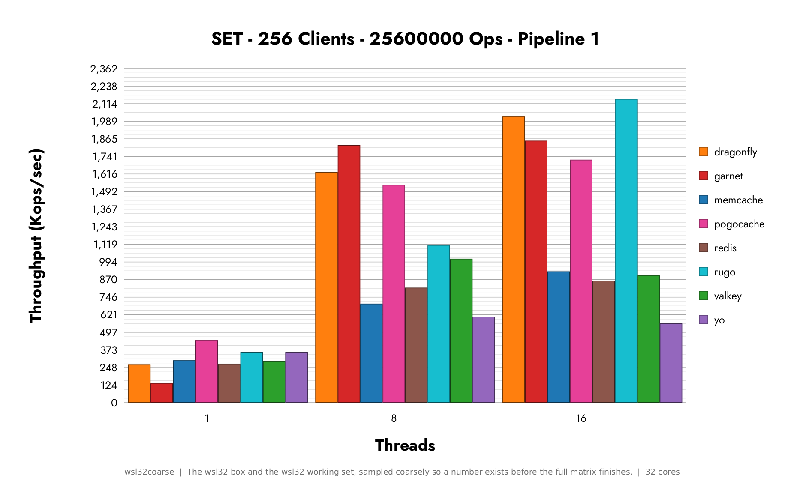
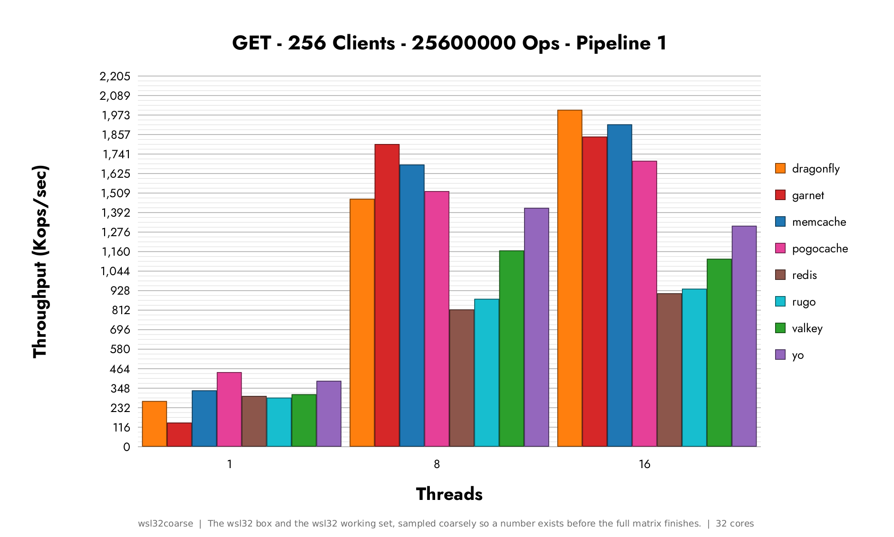
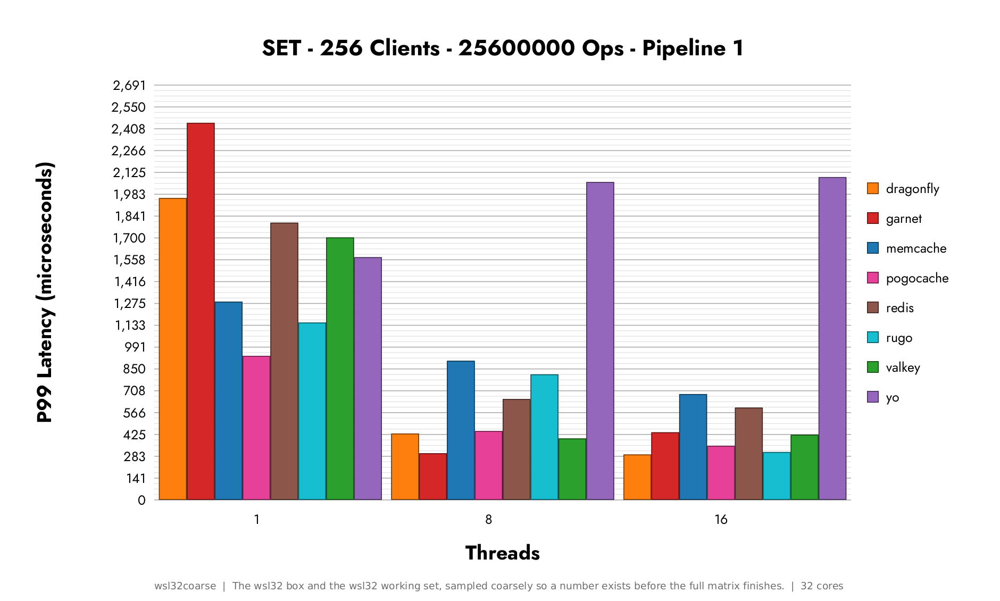
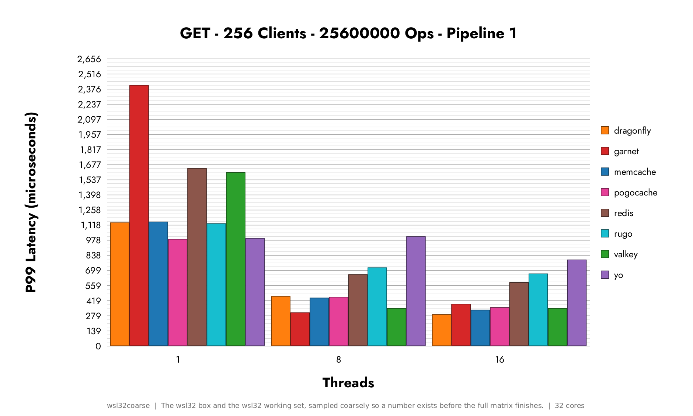
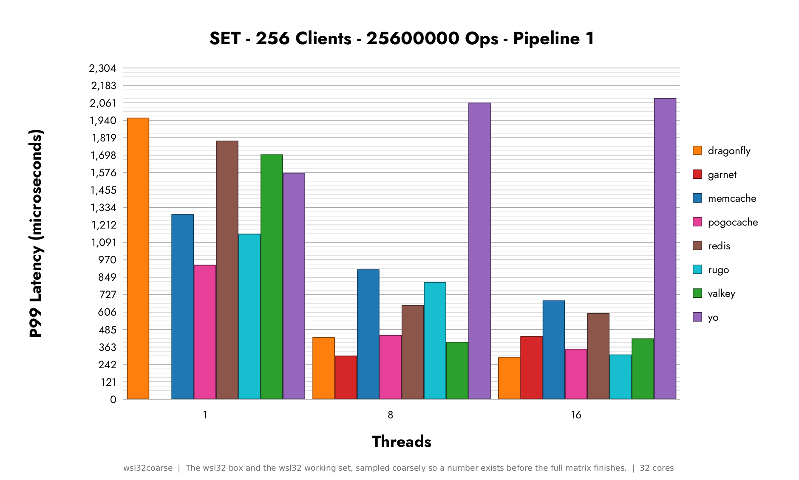
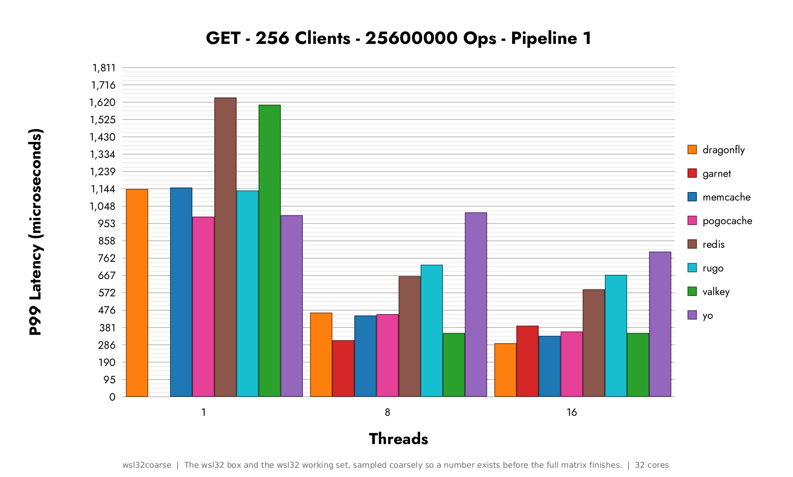

# Cache Benchmarks (wsl32coarse)

Throughput, latency and CPU cycles for [Memcached](https://github.com/memcached/memcached), [Dragonfly](https://github.com/dragonflydb/dragonfly), [Valkey](https://github.com/valkey-io/valkey), [Redis](https://github.com/redis/redis), [Garnet](https://github.com/microsoft/garnet), [Pogocache](https://github.com/tidwall/pogocache), [yo](https://github.com/tamnd/yo) and [rugo](https://github.com/tamnd/rugo).

This is a Rust port of [tidwall/cache-benchmarks](https://github.com/tidwall/cache-benchmarks). The numbers here were measured by this harness on the hardware described below, and they are not the original's numbers. Do not compare a bar here against a bar there.

This file is generated by `cache-bench docs` from `output.json` and `host.json` in this directory. Editing it by hand will not survive the next run.

Read [NOTES.md](NOTES.md) first. It is written by hand and it says what is true of these numbers in particular rather than of the harness.

- Persistence is off for every server, no disk operations.
- Every connection is a local unix socket, so no network stack is measured.
- The server is pinned to CPUs 0-15 and the load generator to CPUs 16-31.
- The load generator is memtier_benchmark v=2.5.1 sha=5f634d17:0 bits=64 libevent=2.1.12-stable openssl=OpenSSL 3.5.5 27 Jan 2026 prometheus=yes.
- 16 threads of 16 connections each, so 256 connections, doing 100000 operations each per pass.
- Values are 1-1024 bytes, over a key space of 10000000, with a 32gb memory limit on every server so that nothing is ever evicted.
- Server I/O threads swept at 1, 8 and 16.
- Pipelining at 1, 10, 25 and 50.
- 5 runs per cell, 96 cells, 480 runs in all.
- The median of the 5 runs is plotted, taken from the middle of a window with 10 percent trimmed off each end.
- Latency is reported at MIN, AVG, the 50th, 90th, 99th, 99.9th and 99.99th percentiles, and MAX.
- CPU cycles: no, this host exposes no hardware PMU.
- There is a warmup pass at the start of every run, a dry run of all the SET operations, and it is not part of the measurement.

The Threads on the x axis of every chart is the number of I/O threads the server was given. It is not the number of clients, which is held at 256 on every point of every chart. This is the single most misread thing about these charts.

## The hardware

| | |
|---|---|
| Profile | wsl32coarse |
| What it is | The wsl32 box and the wsl32 working set, sampled coarsely so a number exists before the full matrix finishes. |
| CPU | 13th Gen Intel(R) Core(TM) i9-13900K |
| Logical CPUs | 32 |
| Memory | 32861884kb |
| Kernel | Linux 6.18.33.2-microsoft-standard-WSL2 x86_64 |
| Distribution | Ubuntu 26.04 LTS |
| Frequency governor | none, this kernel exposes no cpufreq driver and the frequency was chosen outside it |
| CPU mitigations | 19 known, all of them mitigated |
| Hardware PMU | no, this host exposes no hardware PMU |
| First run started | 2026-09-08T07:20:40Z |
| Last run started | 2026-09-09T09:57:33Z |

There is no hostname here and there is not going to be one. A results directory gets published and a machine name is not something to publish, so the host is described by what it is rather than by what it is called.

## Versions

| Cache | Version |
|---|---|
| Dragonfly | dragonfly v1.40.2-e94300e6990093ec093cfb00d60c2e77ea4907e4 |
| Garnet | GarnetServer 2.1.5+00dc848633d66e3f7212d40614c2e697152d388a |
| Memcached | memcached 1.6.45 |
| Pogocache | pogocache 1.3.2 |
| Redis | Redis server v=8.10.1 sha=3399357e:0 malloc=jemalloc-5.3.0 bits=64 build=8693572105b72e6c |
| rugo | rugo 0.1.0 |
| Valkey | Valkey server v=9.1.2 sha=7f1dffed:0 malloc=jemalloc-5.3.0 bits=64 build=e0669b3824fb4a7b |
| yo | yo 0.3.28 |
| memtier_benchmark | memtier_benchmark v=2.5.1 sha=5f634d17:0 bits=64 libevent=2.1.12-stable openssl=OpenSSL 3.5.5 27 Jan 2026 prometheus=yes |
| rustc | rustc 1.98.0 (88d9e12ae 2026-08-18) |
| cache-bench | 0.5.1 (9cbbcb7) |

Every row above the last three is the version string the server itself printed when it was started for these runs, not a list kept by hand.

# Benchmarks

The five the original leads with, in linear scale, at pipeline depth 1. There are 146 charts in this directory and the two indexes below have every one of them.

- [All Benchmarks Linear Scale](LINEAR.md)
- [All Benchmarks Logarithmic Scale](LOGARITHMIC.md)

## Throughput

## Latency 99th Percentile

Garnet is left out at one thread, where its P99 is far enough above the rest that on a linear scale the other engines become stubs.

See it with Garnet

## CPU Cycles

*Not drawn: graph_cpucycles-pipeline_1-kind_median-scale_linear.png. This host exposes no hardware PMU, so cycles per operation was never measured here.*

## How a number got made

One run is one cell measured once: a server, a thread count, a pipeline depth, whether counters were attached, and a run index. The server is started fresh for every run with persistence off and a memory limit large enough that nothing is evicted, the load generator warms it up and the warmup is thrown away, then the measured pass runs and the server is stopped. Runs with counters attached are a separate half of the matrix, because attaching a counter is not free and the throughput numbers should not carry its cost.

A counter the machine cannot measure comes back as text rather than as a number. It is carried as not measured all the way through and the bar is left off the chart, rather than being read as a zero, which would be a claim about the engine that the hardware never made.

Charts are drawn from the `output.json` sitting next to them, and redrawing all 154 of them is one command that needs nothing installed but Rust. The point of that is that nobody has to trust us. If you think the selection is wrong or a scale is misleading, the data to redraw it your way is here.

The long version is [docs/methodology.md](../../docs/methodology.md), and it is the document that decides whether these charts are believed.

## Differences from the original

Every one of them, with the reasoning in [divergences.md](../../divergences.md). The rule is that a divergence is either listed there or it is a bug, and nothing gets to be an undocumented improvement.

| Divergence | What it does | Moves a plotted number |
|---|---|---|
| [D1 to D4, the statistics](../../divergences.md#d1-to-d4-the-statistics) | Four defects in the original's run selection are corrected. `--compat=upstream` reproduces them exactly. | yes |
| [D5, an added spread object](../../divergences.md#d5-an-added-spread-object) | Chosen files carry the interquartile range, the standard deviation and the coefficient of variation. Nothing plots them. | no |
| [D6, fonts](../../divergences.md#d6-fonts) | Jost and DejaVu Sans, embedded in the binary, instead of Futura and Verdana, which only resolve on a Mac. | no |
| [D7, a --threads flag on yo](../../divergences.md#d7-a---threads-flag-on-yo) | The x axis of every chart is a thread count, so a server with no way to set one cannot be plotted. | yes |
| [D8, hardware profiles](../../divergences.md#d8-hardware-profiles) | Core pinning, thread sweep, memory limit and client count are data rather than constants, so the harness runs on a box that is not a c8g.8xlarge. | yes |
| [D9, no Python](../../divergences.md#d9-no-python) | The chart engine lays out the axes and draws the pixels itself, so the same numbers produce the same bytes everywhere. | no |
| [D10, an added subject](../../divergences.md#d10-an-added-subject) | `yo` and `rugo` are a seventh and an eighth engine the original does not have. Everything the original measures is still measured. | no |
| [D11, unsupported perf counters](../../divergences.md#d11-unsupported-perf-counters) | A counter the machine cannot measure leaves the bar off the chart rather than drawing it at zero. | yes |
| [D12, Dragonfly's memory limit](../../divergences.md#d12-dragonflys-memory-limit) | Dragonfly gets the same limit as everything else. The original's arithmetic gives it one gigabyte less than the rest. | yes |
| [D13, the x tick offset](../../divergences.md#d13-the-x-tick-offset) | The thread count under a group of bars is centred under the group for any number of engines rather than for exactly six. | no |
| [D14, one canvas size](../../divergences.md#d14-one-canvas-size) | Every chart is the same size, so two of them can be flipped between without everything shifting sideways. | no |
| [D15, the provenance stamp](../../divergences.md#d15-the-provenance-stamp) | Every chart drawn from real measurements says which host produced it. | no |
| [D16, the chart indexes](../../divergences.md#d16-the-chart-indexes) | Both indexes are generated, they cover all 154 charts rather than 120, and every image has a real alt text. | no |
| [D17, an added host record](../../divergences.md#d17-an-added-host-record) | Each results directory carries a `host.json` saying what it was measured on, with nothing in it that names the machine. | no |
| [D18, a generated results README](../../divergences.md#d18-a-generated-results-readme) | The methodology and the version table are generated from the results rather than typed, so they cannot disagree with the data above them. | no |
| [D19, the numbers carry their own caveat](../../divergences.md#d19-the-numbers-carry-their-own-caveat) | What these numbers may and may not be used for is emitted next to the charts rather than kept in a document nobody following a chart link will open. | no |
| [D20, pinned before exec, and stopped as a group](../../divergences.md#d20-pinned-before-exec-and-stopped-as-a-group) | The CPU pin is applied in the server itself rather than by wrapping it in taskset, and every run confirms its process group is gone before the next one starts. | no |
| [D21, counters read machine readable, and utilisation computed](../../divergences.md#d21-counters-read-machine-readable-and-utilisation-computed) | perf is asked for its comma separated output rather than its human table, and CPUs utilized is computed from `task-clock` and a measured duration rather than scraped out of a comment column. | no |
| [D22, a colour belongs to a server](../../divergences.md#d22-a-colour-belongs-to-a-server) | A bar colour is looked up by which server it is rather than by where the server sorted in that sweep, so the same engine is the same colour in every chart. | no |
| [D23, a memory measurement](../../divergences.md#d23-a-memory-measurement) | What each engine costs to hold a known number of keys, which the original does not measure at all. Reported as both a total and an overhead per entry, because they are different claims. | no |
| [D24, a profile that cannot be published from](../../divergences.md#d24-a-profile-that-cannot-be-published-from) | A profile can say its numbers are not comparable off the box that produced them, and `docs` refuses a results README from one. The sweep still runs, because answering whether a change helped is what such a profile is for. | no |
| [D25, a rate that has to cover the run it is a rate for](../../divergences.md#d25-a-rate-that-has-to-cover-the-run-it-is-a-rate-for) | memtier derives `Ops/sec` from the first of its load generator threads to finish, so a pass whose threads finished far apart is refused rather than charted at a rate the server never reached. | yes |

## What these numbers may and may not be used for

They may be used to compare these cache servers against each other, on the stated architecture, over unix sockets, for GET and SET of 1 to 1024 byte values at 256 connections, at the stated pipeline depths, with persistence off and no eviction. That is a narrow claim and it is the one this harness supports.

They may not be used to say one engine is faster than another, full stop. This workload has no expiry, no eviction, no mixed command set, no large values, no network, no replication, no persistence and no multi key operations. It is a hot path measurement of two commands. Wherever a number from here is published, that sentence goes with it.

